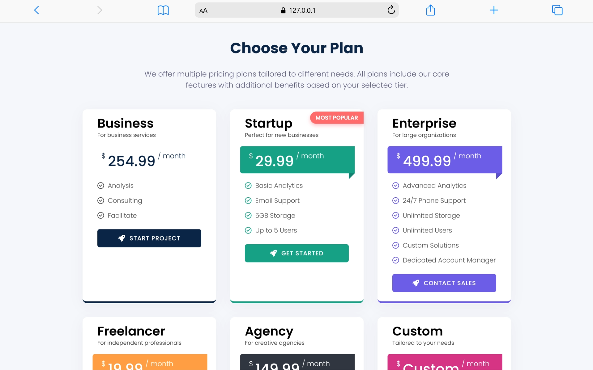

# Pricing Card Component

A modern, responsive pricing card component with multiple plan variants, smooth animations, and user-friendly design. Perfect for SaaS platforms, agencies, and service-based businesses.



## Features

✨ **Modern Design**
- Clean, professional UI with smooth animations
- Rounded corners and subtle shadows
- Responsive layout that works on all devices

🎨 **Multiple Plan Variants**
- Business (Base Plan)
- Startup (Most Popular)
- Enterprise
- Freelancer
- Agency
- Custom
- Professional

🌈 **Custom Color System**
- CSS Variables for easy color customization
- Unique color scheme for each plan
- High contrast text for accessibility

📱 **Fully Responsive**
- Mobile-first design
- Works seamlessly on tablets and desktops
- Optimized breakpoints for all screen sizes

✨ **Interactive Elements**
- Hover animations with transform effects
- Popular badge with centered positioning
- Smooth transitions on buttons and cards
- Ribbon-style price display with CSS triangles

## Project Structure

```
price-card/
├── index.html          # Main HTML file with pricing cards
├── style.css           # Complete styling with CSS variables
├── README.md           # Project documentation
└── preview.png         # Preview image (add your screenshot here)
```

## CSS Variables & Color Palette

The project uses CSS custom properties (variables) for easy customization:

```css
:root {
  --bg: #f5f7fa;              /* Background color */
  --primary: #0b2545;         /* Primary text and borders */
  --muted: #5a5a7a;           /* Secondary text */
  --card-shadow: rgba(207, 212, 222, 0.3); /* Card shadow */
  
  /* Plan Colors */
  --startup: #16a085;         /* Startup Plan - Teal */
  --enterprise: #6c5ce7;      /* Enterprise Plan - Purple */
  --freelancer: #ff9f43;      /* Freelancer Plan - Orange */
  --agency: #2f3640;          /* Agency Plan - Dark Gray */
  --custom: #d63384;          /* Custom Plan - Magenta */
  --professional: #0984e3;    /* Professional Plan - Blue */
  --badge: #ff6b6b;           /* Popular Badge - Red */
}
```

## Key CSS Classes

### `.plan-card`
Base styling for all pricing cards with hover effects and shadows.

```css
.plan-card {
  background: #fff;
  width: 18rem;
  border-bottom: 4px solid var(--primary);
  box-shadow: 0 6px 30px var(--card-shadow);
  transition: transform 0.3s ease, box-shadow 0.3s ease;
}
```

### `.etiquet-price`
Price ribbon with colored backgrounds and triangle decoration.

```css
.etiquet-price {
  position: relative;
  background: var(--variant-color);
  color: var(--primary);
  border-radius: 5px 0 0 5px;
  z-index: 1;
}
```

### `.popular-badge`
Centered badge for highlighting the most popular plan.

```css
.popular-badge {
  position: absolute;
  top: -10px;
  left: 50%;
  transform: translateX(-50%);
  background: var(--badge);
  color: white;
  padding: 6px 16px;
  border-radius: 20px;
}
```

### Variant Classes
- `.plan-card.startup` - Teal theme
- `.plan-card.enterprise` - Purple theme
- `.plan-card.freelancer` - Orange theme
- `.plan-card.agency` - Dark gray theme
- `.plan-card.custom` - Magenta theme
- `.plan-card.professional` - Blue theme

## Responsive Breakpoints

| Screen Size | Changes |
|-------------|---------|
| 1200px+ | Full 6-column layout with 30px gaps |
| 768px - 1200px | Flexible wrapping with max 900px width |
| 480px - 768px | Cards max width 350px |
| < 480px | Single column, reduced padding |

## Customization Guide

### Change Colors
Update the CSS variables in the `:root` selector:

```css
:root {
  --startup: #YOUR_COLOR_HERE;
}
```

### Adjust Card Width
Modify `.plan-card` width property:

```css
.plan-card {
  width: 20rem; /* Increase from 18rem */
}
```

### Modify Gap Between Cards
Update `.pricing-container` gap:

```css
.pricing-container {
  gap: 40px; /* Increase from 30px */
}
```

### Change Font
Update the font-family in `body`:

```css
body {
  font-family: "Your Font", sans-serif;
}
```

## HTML Structure

Each pricing card follows this structure:

```html
<div class="plan-card startup">
  <!-- Optional Popular Badge -->
  <div class="popular-badge">MOST POPULAR</div>
  
  <!-- Plan Title & Subtitle -->
  <h2>Plan Name<span>Plan description</span></h2>
  
  <!-- Price Ribbon -->
  <div class="etiquet-price">
    <p>99.99</p>
    <div></div> <!-- Triangle decorator -->
  </div>
  
  <!-- Features List -->
  <div class="benefits-list">
    <ul>
      <li>
        <svg><!-- Check icon SVG --></svg>
        <span>Feature name</span>
      </li>
    </ul>
  </div>
  
  <!-- Call-to-Action Button -->
  <div class="button-get-plan">
    <a href="#">
      <svg class="svg-rocket"><!-- Rocket icon --></svg>
      <span>BUTTON TEXT</span>
    </a>
  </div>
</div>
```

## Browser Support

- Chrome 90+
- Firefox 88+
- Safari 14+
- Edge 90+

## Getting Started

### 1. Clone or Download
```bash
git clone <repository-url>
cd price-card
```

### 2. Open in Browser
Simply open `index.html` in your web browser, or use a local server:

```bash
# Using Python 3
python -m http.server 8000

# Using Python 2
python -m SimpleHTTPServer 8000

# Using Node.js (if http-server is installed)
http-server
```

Visit `http://localhost:8000` in your browser.

### 3. Customize
Edit `style.css` to change colors, spacing, fonts, or layout.
Edit `index.html` to modify plan names, prices, features, and descriptions.

## Features Breakdown

### 1. Color System
Uses CSS variables (custom properties) for:
- Easy theme switching
- Consistent color palette
- Reduced code repetition
- Better maintainability

### 2. Responsive Grid
Flexbox-based layout that:
- Wraps cards on smaller screens
- Centers content
- Maintains consistent spacing
- Adapts gap between cards

### 3. Interactive Animations
- Card hover: Slight lift with enhanced shadow
- Button hover: Transform and shadow effect
- Smooth transitions on all interactive elements

### 4. Accessibility Features
- High contrast text
- Proper semantic HTML
- ARIA-friendly structure
- Readable font sizes

### 5. Ribbon Price Display
- CSS triangle decoration
- Proper z-index layering
- Visible text on colored backgrounds
- Responsive width adjustment

## Tips for YouTube Content

### For Video Tutorials:
1. **Start with the basics** - Explain HTML structure
2. **Introduce CSS variables** - Show color system benefits
3. **Build variants** - Add each plan's color scheme
4. **Add animations** - Demonstrate hover effects
5. **Make it responsive** - Show media queries in action
6. **Customize colors** - Show how to change the palette

### For Best Results:
- Use a code editor with syntax highlighting (VS Code recommended)
- Zoom in on the code for visibility
- Show the browser preview after each step
- Explain the responsive behavior at different screen sizes
- Mention accessibility considerations

## File Sizes

- `index.html`: ~8KB
- `style.css`: ~12KB
- Total: ~20KB (very lightweight!)

## License

This project is open source and available for personal and commercial use.

## Credits

Designed and developed for modern web development practices and best practices in responsive design.

---

## Quick Links

- [W3Schools CSS Variables](https://www.w3schools.com/css/css3_variables.asp)
- [MDN Flexbox Guide](https://developer.mozilla.org/en-US/docs/Learn/CSS/CSS_layout/Flexbox)
- [CSS Shadow Generator](https://www.cssmatic.com/box-shadow)

## Contact & Support

For questions or suggestions, feel free to reach out!

---

**Last Updated:** January 22, 2026
**Version:** 1.0
